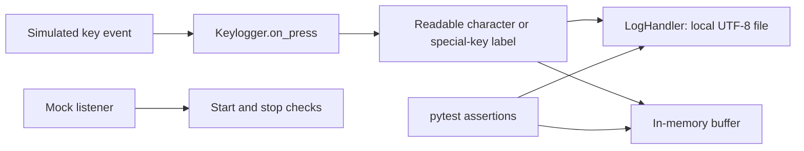
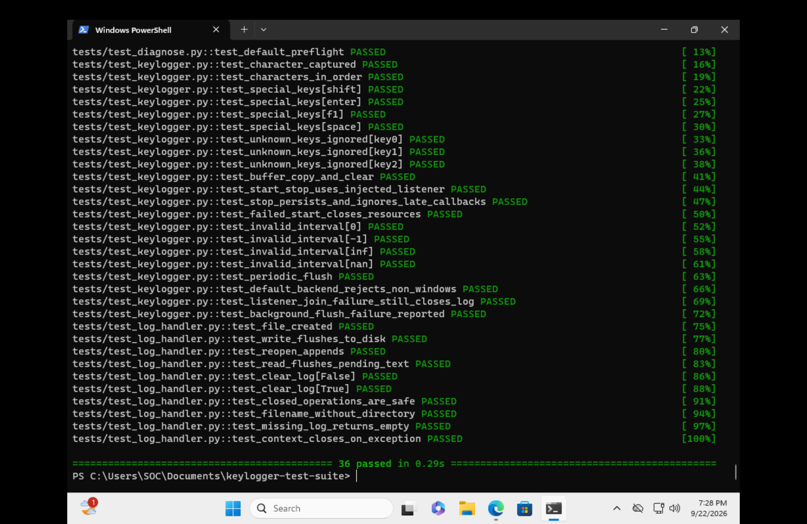
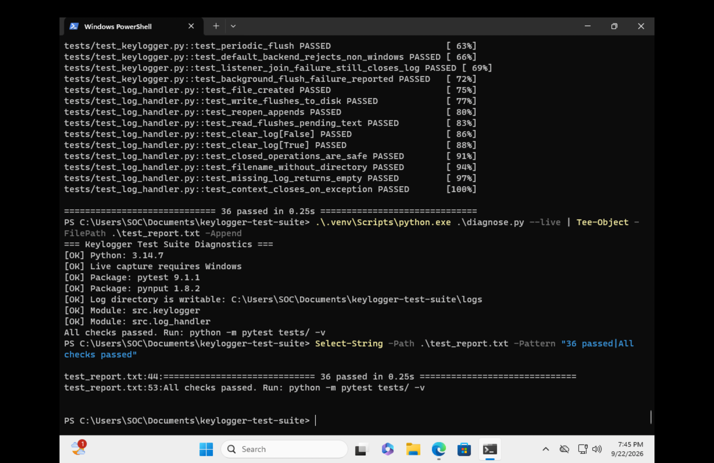

# Windows Keyboard Event Testing Lab

A Python testing and troubleshooting project built in a Windows 11 lab. It verifies how a keyboard-event module handles characters, writes local logs, and releases resources when a session ends or encounters an error.

**Result: 36 automated tests passed in the Windows lab.** The tests use simulated events and mock listeners. The screenshots demonstrate the lab run; actual Windows keyboard-hook behavior has not been validated.

**Skills demonstrated:** Python · pytest · unittest.mock · file I/O · exception handling · environment diagnostics · PowerShell · technical documentation

## Project progression

I first explored keyboard callbacks and timestamped local logging in a small macOS Python prototype. I then completed this guided Windows testing lab, moving into separated components, mock listeners, automated checks, and reproducible evidence. The [prototype-to-test-suite walkthrough](docs/project-evolution.md) compares the source and explains the design changes. This is a learning progression; the current suite does not directly import the earlier script. Its timestamp and Escape shortcut were not carried into the current module.

## What this project does

The project separates event handling from file storage so each part can be tested independently. This makes it possible to investigate a failed test without collecting real keyboard input.



For example, a simulated `a` becomes `a`, while a simulated Shift event becomes `[shift]`. The tests check both the recorded event order and the resulting file contents.

## Results and evidence

| Component | Passing cases | What they check |
|---|---:|---|
| Log handler | 10 | Creation, append, Unicode, flush, clear, missing files, and cleanup |
| Keyboard-event module | 21 | Characters, special keys, ignored input, buffers, mocked lifecycle, periodic flush, and failure cleanup |
| Diagnostics | 5 | Write access, missing packages, platform checks, and default preflight |
| **Total** | **36** | Simulated functional and unit tests |

These are collected test cases, including parameterized cases. The count is not a code-coverage percentage or a performance benchmark.

**Windows lab:** Windows 11 VM `win11-soc-lab`, Python 3.14.7, pytest 9.1.1, pynput 1.8.2.

**Maintained-source CI:** [The initial GitHub Actions run passed on Windows and Linux](https://github.com/thmzhanbu/windows-keyboard-event-test-suite/actions/runs/35823412189) for commit `032e860d84c8c926840812e1a6b9c52a0e79054e`. Both jobs succeeded; the Windows job collected 36 tests. This verifies the simulated suite on hosted runners, not live keyboard capture.



The saved-report check finds both the passing test count and the diagnostic success message:



[Detailed keyboard-event test results](docs/screenshots/08-keyboard-event-tests-passed.png) · [Evidence review and remaining gaps](docs/evidence-and-gaps.md)

**Evidence note:** This repository maintains the source prepared for the guided lab. The supplied screenshot folder did not contain an export of the VM's source files or its actual `test_report.txt`. Windows screenshots are historical evidence of the walkthrough version; the separately labeled [macOS verification report](reports/macos-verification.txt) records a test of this repository's source. They are not presented as the same run. Minor walkthrough differences include sample input strings and diagnostic wording.

## Run the project

Use Python 3.9 or newer. From the repository folder in Windows PowerShell:

```powershell
py -m venv .venv
.\.venv\Scripts\python.exe -m pip install -r requirements.txt
.\.venv\Scripts\python.exe diagnose.py --live
.\.venv\Scripts\python.exe -m pytest tests/ -v
```

The `--live` option checks Windows and the installed `pynput` distribution. It does not start a listener or verify actual OS events. None of the commands above captures real input.

On macOS/Linux, create the environment with `python3 -m venv .venv`, use `.venv/bin/python` for the remaining commands, and omit `--live`. `pynput` is installed only on Windows. See [the code and command walkthrough](docs/code-walkthrough.md) for an explanation of each step.

Dependencies have bounded ranges. The exact package versions used for the new local verification are saved in [reports/macos-environment.txt](reports/macos-environment.txt); the Windows versions above come from the screenshots.

## Save a report

Run these commands from the repository folder. The output is saved as UTF-8 so GitHub can display the text clearly.

```powershell
.\.venv\Scripts\python.exe -m pytest tests/ -v --tb=short 2>&1 | Out-File -Encoding utf8 test_report.txt
if ($LASTEXITCODE -ne 0) { throw "Tests failed; inspect test_report.txt" }
.\.venv\Scripts\python.exe diagnose.py --live 2>&1 | Out-File -Encoding utf8 -Append test_report.txt
if ($LASTEXITCODE -ne 0) { throw "Diagnostics failed; inspect test_report.txt" }
Select-String -Path test_report.txt -Pattern "36 passed|All checks passed"
```

Keep the entire report, including the environment header and test names. Checking the exit codes prevents a diagnostic success message from hiding a failed test run.

## Repository guide

```text
src/
  keylogger.py                 Event handling and listener lifecycle
  log_handler.py               UTF-8 file storage
tests/
  test_keylogger.py            21 keyboard-event test cases
  test_log_handler.py          10 file-handling test cases
  test_diagnose.py              5 diagnostic test cases
diagnose.py                    Environment preflight
docs/
  project-evolution.md         Earlier prototype and design progression
  prototype-source.py.txt      Original prototype preserved as source text
  code-walkthrough.md          Important code and commands explained
  interview-notes.md           Project explanation and interview practice
  evidence-and-gaps.md         Screenshot review and improvement plan
  screenshots/                Windows results and prototype warning evidence
reports/                      Separately labeled local verification
.github/workflows/tests.yml    Windows and Linux automated test workflow
requirements.txt              Dependency ranges
pyproject.toml                pytest discovery settings
logs/.gitkeep                 Empty local-log directory
```

## Design choices and limits

- **Dependency injection:** tests supply a mock listener, making event logic testable without operating-system hooks.
- **Isolated files:** each test uses a temporary directory and closes file handles, avoiding shared log files and Windows cleanup conflicts.
- **Explicit shutdown:** stop joins the listener and flush worker before closing the log. A closed session cannot restart.
- **Error visibility:** periodic flush failures are reported during shutdown. The session does not automatically recover or stop as soon as storage fails.

The buffer is unbounded, logs have no timestamps or rotation, and shutdown joins have no timeout. Lifecycle calls must be made serially from the controlling thread. A file flush does not guarantee survival of a power failure. These are documented limits of a small testing lab, not production guarantees.

The included [GitHub Actions workflow](.github/workflows/tests.yml) runs the simulated suite on Windows and Linux with Python 3.14 after pushes and pull requests. The initial run linked above passed; check the run attached to any later commit before claiming that revision passed. The next useful improvements are an exported original Windows source/report snapshot and focused failure tests for import errors and simultaneous startup/cleanup failures. See the [prioritized gap review](docs/evidence-and-gaps.md).

## Learning context

Developed through a guided implementation based on the supplied CleverTailor project brief, with AI assistance for scaffolding, review, and documentation. The lab work includes running the tests in Windows, inspecting failures, checking saved results, and recording evidence. The project demonstrates testing and debugging skills; it does not claim malware analysis, endpoint detection, or production deployment.

Use any live listener only in an authorized local lab with dummy input. Local log contents and virtual environments are excluded by `.gitignore`.
