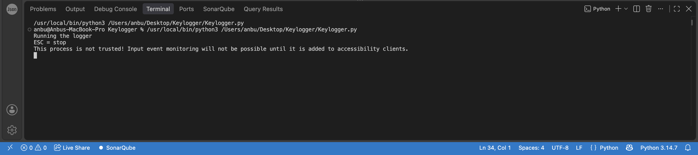

# From a small prototype to a testable project

My earlier `Keylogger.py` prototype explored keyboard callbacks and local file writing on macOS. I later completed the guided Windows testing lab in this repository, extending my learning into modular design, automated tests, diagnostics, and documented results.

This is a progression in learning and design. The current suite does not import the earlier script, and no commit history establishes a direct refactoring from that file. The supplied prototype is preserved as [source text](prototype-source.py.txt) for comparison. Its `.txt` suffix keeps it outside the executable Python modules; the original code starts a real listener at module level.

## What the prototype demonstrates

The small script imports `pynput.keyboard`, defines two callbacks, and writes one timestamped line per event to a fixed local path. The source supports the following explanation; it was reviewed without running the listener.

```python
def on_press(key):
    time_stamp = datetime.datetime.now().strftime("%H:%M:%S")
    try:
        entry = f"{time_stamp}: '{key.char}'"
    except AttributeError:
        entry = f"{time_stamp}: '{key}'"

    with open(log_file, "a") as file:
        file.write(entry + "\n")
```

- `key.char` handles ordinary character events. The `AttributeError` branch uses the key's string representation for special keys.
- `strftime("%H:%M:%S")` adds the local time of handling. It has no date or timezone, so it is not a complete audit timestamp.
- Append mode preserves existing content. The `with` block closes the file after each event; the prototype does not specify an encoding explicitly.

```python
def on_release(key):
    if key == keyboard.Key.esc:
        return False

listener = keyboard.Listener(on_press=on_press,
                             on_release=on_release)
listener.start()
listener.join()
```

The release callback requests a stop when Escape is released. `start()` starts the listener thread and `join()` waits for it to finish. Printing `Stopped!` afterwards indicates that execution returned from `join()`; the message alone does not verify which key stopped it or whether input was captured correctly.

## What changed in the testing lab

| Area | Earlier prototype | Current project | Why the distinction matters |
|---|---|---|---|
| Organization | One script with module-level execution | Separate `Keylogger`, `LogHandler`, tests, and diagnostics | Each responsibility can be inspected and tested independently. |
| Event handling | `on_press`, `key.char`, special-key fallback | Same callback concepts with explicit labels and invalid-input checks | The relationship is conceptual; representations and behavior differ. |
| Storage | Fixed macOS path; open/append/close for every event | Caller-supplied path, explicit UTF-8, locking, flush and close methods | Tests can use separate temporary files and verify cleanup. |
| Listener | Direct `pynput` listener | Injectable listener factory; real backend explicitly restricted to Windows | Tests supply mocks and require no keyboard access. |
| Start and stop | Listener starts when the script is run or imported; Escape release requests stop | Import does not start capture; explicit `start()`/`stop()` and context cleanup | Tests can verify lifecycle behavior without a real listener. |
| Timestamp | `HH:MM:SS` prefix for every event | No event timestamps | This feature was not carried into the current module. |
| Escape shortcut | `on_release` handles Escape | No built-in Escape callback | The controlling code must call `stop()`; this is not feature parity. |
| Validation | Supplied source, local log, and launch screenshots | 36 simulated tests, environment checks, reports, and hosted CI | The later evidence is repeatable and tied to defined test cases. |

The important improvement is the ability to verify behavior systematically. The later project is not presented as a replacement that retains every prototype feature.

## Evidence and its limits



The supplied 4:10 PM screenshot is included as troubleshooting evidence: it shows the script launching in a macOS terminal and a warning that the process is not trusted for input monitoring. It does not establish a successful capture session. The similar 4:16 PM screenshot adds `Stopped!`; it is omitted to avoid repeating the same warning.

The supplied `keylog.txt` contains 56 lines matching the timestamped event format: 41 single-character entries and 15 special-key entries. That is consistent with this script's output format, but the file has no run identifier, source revision, date, or operating-system marker. The available artifacts do not establish that it came from the pictured run. The raw typed content is kept local and excluded from Git; the counts describe the inspected file, not a capture test performed for this repository.

These macOS prototype artifacts also do not replace the missing export of the original Windows VM test-suite source or `test_report.txt`. See [the evidence review](evidence-and-gaps.md).

## How I explain the progression

“I started with a small Python prototype to understand callbacks, special keys, timestamped file output, and an Escape stop condition. I then completed a guided Windows lab that separated event handling from storage and tested the behavior using simulated input and mock listeners. The later project has 36 automated tests and successful Windows/Linux CI. I can explain which behaviors are verified, which prototype features were not carried forward, and why environment checks are different from live capture tests.”

The learning sequence is described by the author. The supplied screenshot dates are not used to infer the original development dates, and AI assistance in the later lab remains acknowledged in the main README.
